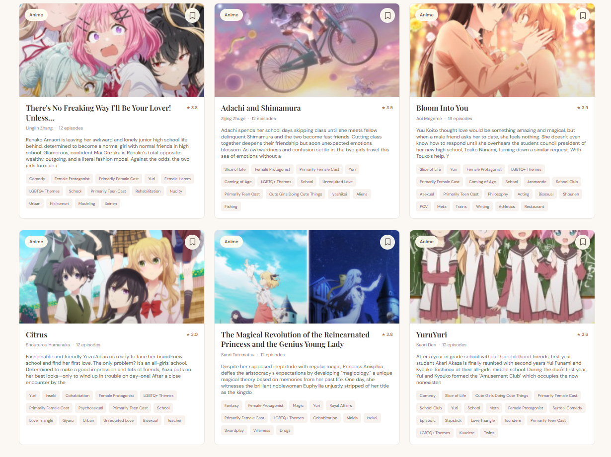

# GLify

**A dedicated space for Girls' Love stories and the people who love them.**

GLify is a community-first discovery platform for Girls' Love (GL) and Yuri media: manga, manhwa, light novels, and live-action series. It will help fans find their next favorite story, connect with like-minded readers, and take part in welcoming, series-specific communities.



## Project status

The responsive web app now loads its curated catalog from the Fastify API backed by Neon Postgres. The database setup command creates the `works` table and inserts the eight starter titles. The AniList importer auto-approves Yuri-tagged titles only when Yuri is among AniList's first six tags; other results remain available for review. The public UI shows approved catalog entries only. When the API or database is unavailable, the UI explicitly reports that it is showing its local sample catalog. Neo4j is optional until graph recommendations are implemented. Sign-in, community discussions, and saved-list persistence are not connected yet. See [`scope.md`](./scope.md) for the product plan and architecture.

## Technology choices

| Area | Choice | Responsibility |
| --- | --- | --- |
| Web app | React, TypeScript, Vite, CSS | Responsive browser UI and discovery experience |
| Web hosting | Vercel | Global static hosting, preview deployments, and custom domain |
| API | Node.js, TypeScript, Fastify | Application API and business logic |
| API hosting | Render | Web service for the TypeScript API |
| Graph | Neo4j AuraDB | Works, characters, user interactions, and recommendation traversals |
| Relational data | Neon Postgres | Accounts, roles, audit records, and transactional metadata |
| Cache / rate limits | Upstash Redis | Short-lived cache, rate limiting, and ephemeral coordination |

The web app and API are separate deployable services. Neo4j AuraDB, Neon, and Upstash are managed services and are accessed only by the API; their credentials must never be exposed to browser code.

## Run locally

Requirements: Node.js 20 or newer and npm.

On Windows, if the integrated terminal cannot find `node` or `npm` even though Node.js is installed, this workspace prepends the standard Node.js install directory to new VS Code terminals. Run **Developer: Reload Window** from the Command Palette, then open a new terminal. If Node.js was installed to a nonstandard directory, update `.vscode/settings.json` to that installation path.

### See the UI with sample stories

```bash
npm install
npm run dev
```

Open the local URL Vite prints (usually **http://localhost:5173**). The UI works without database credentials and shows a status message when it is using sample catalog data.

### Run the API with Neon Postgres

1. Create a Neon project and copy its pooled or direct connection string.
2. From the repository root, install the API dependencies and create its local environment file:

   ```powershell
   npm --prefix server install
   Copy-Item server/.env.example server/.env
   ```

3. Set `DATABASE_URL` in `server/.env` to the full connection string from Neon Console → your project → **Connect**. Replace the entire example value; do not leave `<user>`, `<password>`, `<host>`, or any other placeholders in it. Neo4j variables are optional for now.
4. Create the catalog table and insert the starter titles, then start both apps:

   ```bash
   npm run db:setup
   npm run dev:all
   ```

5. Open **http://localhost:5173**. The API health check is at **http://localhost:3001/health** and the catalog endpoint is **http://localhost:3001/api/works**.

The `db:setup` command is safe to re-run: it creates the table if needed and only inserts sample rows that are not already present. If configuration reports `DATABASE_URL` is invalid, confirm the real Neon URL is in `server/.env` (not the repository-root `.env`) and that template placeholders such as `<host>` have been replaced. Do not paste the connection string into chat or commit `server/.env`.

To run the API alone after setting up Neon, use `npm run dev:server`. The Vite dev server proxies `/api` requests to `localhost:3001`; set `VITE_API_URL` when the API is hosted at a different origin.

### Import real titles from AniList

After configuring `DATABASE_URL` in `server/.env` and running `npm run db:setup`, import the first page of AniList titles tagged with Yuri:

```bash
npm run db:import-anilist                         # first page (up to 50 titles)
npm run db:import-anilist -- --page 2             # next page (up to 50 more)
```

Run the second command to get the **next 50 titles**. Use `-- --page 3`, `-- --page 4`, and so on for later pages. You do not need to rerun `db:setup` between imports. Each page imports up to 50 titles; rerunning a page updates those AniList records instead of creating duplicates, and leaves other catalog rows alone.

The importer searches AniList's **tags** (not its genres) for Yuri and includes non-spoiler tag names in catalog entries. A title is automatically approved only when the Yuri tag is among the first six tags AniList returns; other Yuri-tagged titles remain in the review queue rather than being discarded. Explicitly approved or rejected decisions are preserved when re-importing. This heuristic reduces weak tag matches but is not definitive; you can still review/approve a title whose Yuri tag appears later. AniList titles may have no rating or community match score, so those fields remain blank rather than presenting the AniList score as a GLify user match. The importer reports how many records it fetched and warns if a page contains no supported media formats.

After importing, run `npm run dev:all` and open **http://localhost:5173** to browse approved catalog results. Check pending matches with `npm run db:curate-anilist -- --list`.

Review imported titles from the repository root:

```powershell
npm run db:curate-anilist -- --list
npm run db:curate-anilist -- --approve anilist-10495
npm run db:curate-anilist -- --reject anilist-18679
```

Choose IDs that actually appear in your own `--list` output. Check each title against a trusted source before approving it. Rejected entries stay in the database but are hidden from the public catalog. If any requested ID is missing, the command fails without changing any of the requested records.

### Build the frontend and API

```bash
npm run build
npm run typecheck:server
```

To preview the production frontend locally, run `npm run preview` after the frontend build.

## Deployment outline

1. Import the repository into Vercel and set the project root to the repository root. Use `npm run build` and `dist` as the output directory.
2. Deploy `server/` as a separate Render web service with the service root directory set to `server`; use `npm install`, `npm run build`, and `npm start`. Configure `DATABASE_URL` and `CORS_ORIGIN` in Render's environment settings.
3. Set `VITE_API_URL` in Vercel to the Render API origin and redeploy the frontend.
4. Provision Neo4j AuraDB when graph-backed recommendation features are ready; configure its credentials only in the API service's environment.
5. Configure managed Redis credentials only in the API service when cache/rate-limit features are implemented.

See [`scope.md`](./scope.md) for architecture details, product milestones, and open decisions.

## GitHub repository description

> A graph-powered Girls' Love (GL) discovery and community platform for manga, manhwa, light novels, and live-action series.

## Suggested GitHub topics

`girls-love`, `yuri`, `gl`, `manga`, `manhwa`, `light-novels`, `community`, `recommendation-engine`, `neo4j`, `typescript`, `react`, `fastify`, `postgresql`, `redis`

## License

No license has been selected yet. Add one before accepting external contributions or distributing the project.
